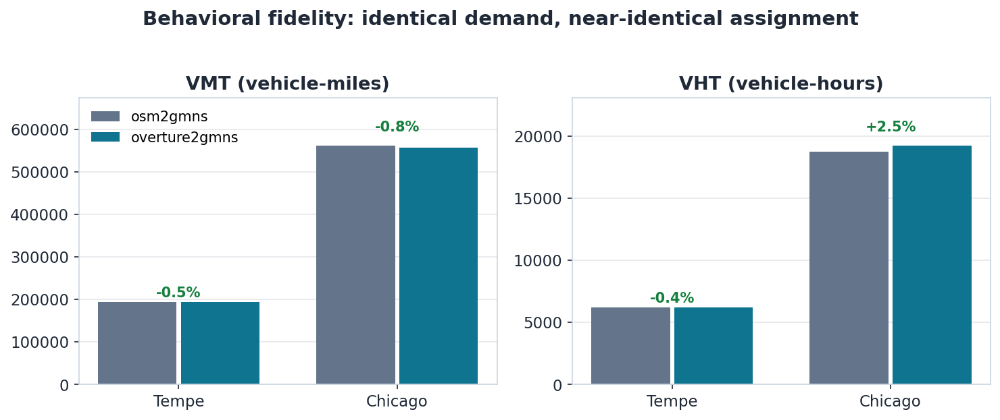
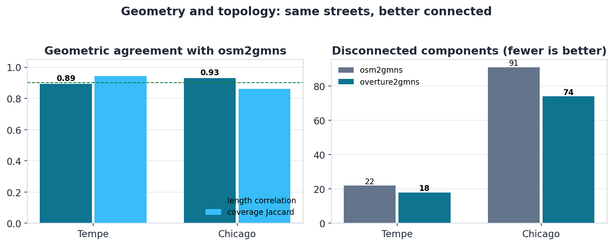
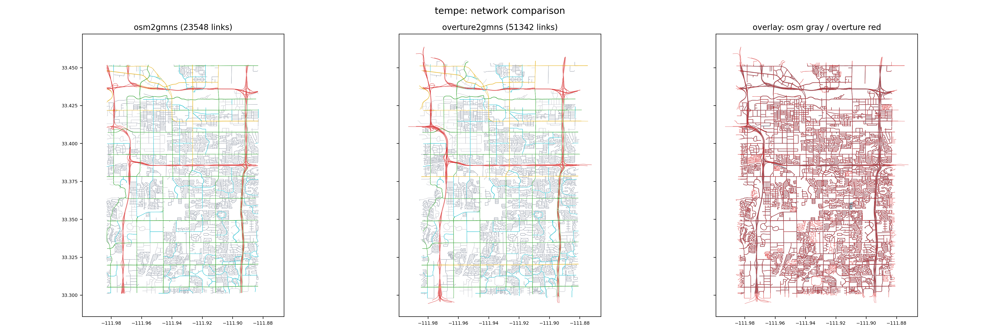
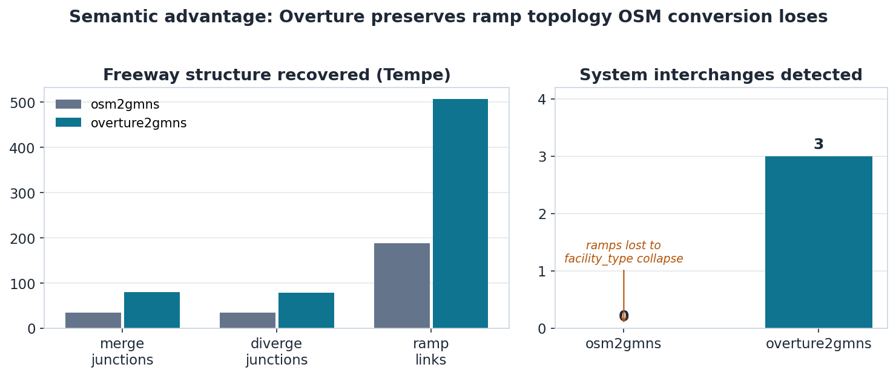
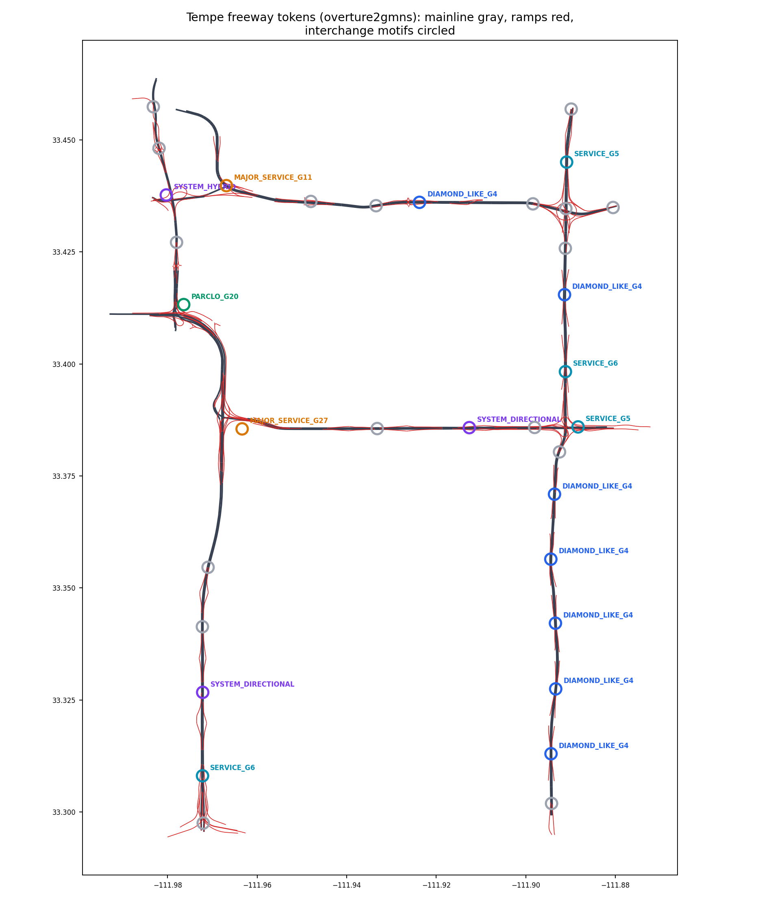
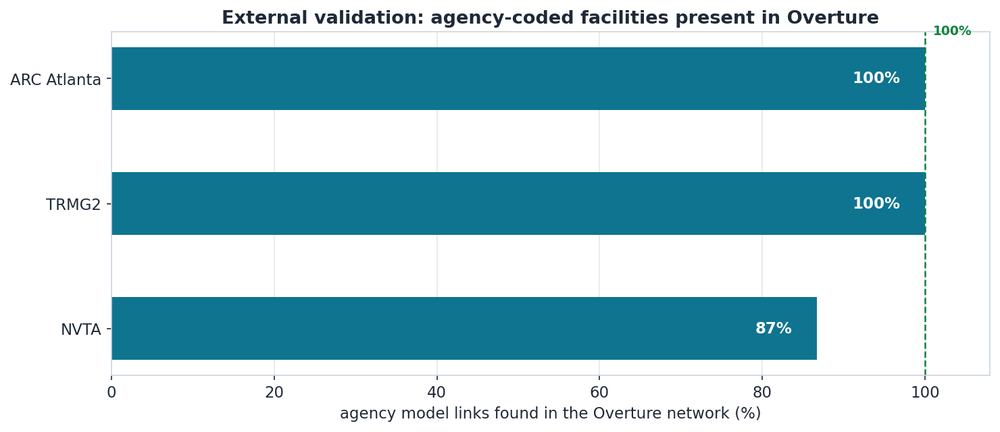

# Conversion Quality QA/QC Report — overture2gmns

**Scope:** fidelity of the overture2gmns conversion, independent of runtime.
All numbers are aggregated by `aggregate_qaqc.py` from the bench artifacts in
`evidence/` and regenerate with one command. Reproduce:

```bash
python research/conversion_quality/aggregate_qaqc.py   # rebuilds evidence/ + qaqc_dataset.json
```

**Test set:** two converter-vs-converter regions (Tempe AZ, Chicago metro,
osm2gmns as reference) and three agency planning models used as external
ground truth (ARC Atlanta, TRMG2 North Carolina, NVTA Northern Virginia —
NVTA network data is agency-restricted; only aggregate statistics appear here).

**Restricted-data policy:** no NVTA network files are copied into this folder;
`evidence/nvta_*.json` contain counts, verdicts, and match rates only.

---

## 1. Quality dimensions

Conversion quality is assessed on six independent axes, each with its own
evidence. A converter can pass one and fail another (e.g., perfect geometry
with broken directionality), so all six are reported separately.

| # | dimension | question | primary evidence |
|---|---|---|---|
| 1 | GMNS validity | is the output a well-formed GMNS network? | gmns-ready, dtalite_qa |
| 2 | Geometric coverage | are the same streets present, in the same place? | grid length correlation, map-match |
| 3 | Attribute fidelity | are speed/lanes/capacity/class right? | length-by-class, speed-by-class, capacity semantics |
| 4 | Topological integrity | is connectivity and directionality correct? | weak components, one-way audit |
| 5 | Semantic fidelity | are interchanges/ramps/managed lanes preserved? | interchange & ML tokens |
| 6 | Routing consistency | does it route the same under *matched* (synthetic demand + inferred capacity) assumptions? | TAPLite VMT/VHT diff |

> Dimension 6 is a **relative** check, not validation: there is no observed OD
> and no observed capacity (neither data source provides capacity), so it
> isolates the network as the variable rather than forecasting real volumes.

---

## 2. Headline verdict

overture2gmns output is **GMNS-valid, geometrically faithful, and routes
consistently with osm2gmns under matched assumptions**, and it **preserves
semantic freeway structure that osm2gmns loses**. The defects found during
development were all in the *pipeline* (format round-trips, rule-scope
handling, capacity units), not the source data, and all are fixed and
regression-tested.

| region | GMNS valid | geom corr (common cells) | VMT diff vs osm (synthetic demand) | verdict |
|---|---|---:|---:|---|
| Tempe | 0 errors | 0.89 | **-0.5%** | routes consistently |
| Chicago metro | 0 errors | 0.93 | **-0.8%** | routes consistently |



> **What this does and does not show.** The demand is *synthetic* (all-pairs
> among grid-sampled centroids) — there is **no observed OD** — and capacity
> is an *inferred class default* in both networks, since **neither Overture
> nor OSM provides observed capacity**. So this is a **controlled relative
> comparison** that isolates the network as the only variable: same demand,
> same capacity assumptions, only the converter output differs. A small VMT
> gap therefore means the network representation itself does not cause routing
> divergence. It is **not** a validated volume forecast, and **VHT is more
> sensitive** to the capacity/demand assumptions than VMT (see §8).

---

## 3. Dimension 1 — GMNS validity

Every converted network passes both gmns-ready checks (quick_check,
validate_network) with **0 errors**, and the dtalite_qa (taplite4mpo) gate
returns ok. This holds for the converter output (Tempe, Chicago) and for all
three agency networks run through the same validators.

| network | gmns-ready quick_check | validate_network | dtalite_qa |
|---|---|---|---|
| Tempe overture2gmns | 0 errors | 0 errors | — |
| Chicago overture2gmns | 0 errors | 0 errors | — |
| ARC Atlanta | 0 errors | 0 errors | ok |
| TRMG2 | 0 errors | 0 errors | ok |
| NVTA | 0 errors | 0 errors | ok |

Warnings remain (centroid grouping, dual-unit hints) but no errors. Bug #4
(unsorted link.csv failing the Level-3 dual-unit check) was fixed by
emitting forward-star-sorted links plus `vdf_length_mi`/`vdf_free_speed_mph`.

## 4. Dimension 2 — geometric coverage

Directed link length aggregated on a ~500 m grid, then correlated between the
osm2gmns and overture2gmns networks:

| region | correlation (common cells) | correlation (union) | coverage Jaccard |
|---|---:|---:|---:|
| Tempe | **0.89** | 0.80 | 0.94 |
| Chicago | **0.93** | 0.80 | 0.86 |

The common-cell correlation isolates conversion agreement; the union
correlation is lower only because the OSM extracts are polygon-clipped while
the Overture pull is a bounding rectangle (extra Overture coverage at bbox
corners). Map-matching confirms directionally: **osm2gmns links match onto
the overture2gmns network at 99.3%** (Tempe) — everything OSM has, Overture
has and places within tolerance.



The two converters describe the same streets (left), and the
overture2gmns network is *more* connected — fewer disconnected components
(right). Visual overlay of the full networks:



*Tempe: osm2gmns (left), overture2gmns (center), overlay (right, OSM gray /
Overture red). Red covering gray = agreement.*

## 5. Dimension 3 — attribute fidelity

**Speed:** length-weighted mean free speed agrees closely by class; Overture
carries observed (TomTom-normalized) limits where present, marked
`speed_source=overture`, vs class defaults elsewhere.

**Capacity — inferred in both, not from either source.** Neither Overture nor
OSM provides observed link capacity, so *both* converters assign class
defaults; this is a convention-correctness check, not a data-fidelity claim.
The bug that was fixed (bug #3) was a *units* error: the GMNS `capacity`
column is TOTAL link capacity (osm2gmns and TAPLite kernel convention) and
overture2gmns initially wrote per-lane. After the fix, motorway reads
2,200 pc/h/ln × lanes, matching the osm2gmns default (2,300) and the HCM base
value — i.e., the two converters now use *consistent inferred defaults*, which
is what makes the §8 relative comparison fair. Observed capacity (e.g., from
INRIX speed-flow or agency tables) is a separate input neither tool has today.
**Agency caution:** MWCOG/NVTA freeway capacities are ~950 vph/ln
(period/service capacity) — a different quantity from HCM, never compared raw.

**Class:** Overture promotes some OSM secondary mileage to primary
(offsetting +/- shifts), harmless for assignment but relevant if capacity
defaults key off functional class.

## 6. Dimension 4 — topological integrity

**Connectivity:** the overture2gmns network is *more* connected than the
osm2gmns reference in both regions — fewer disconnected components and a
larger routable share.

| region | osm weak components | ovr weak components |
|---|---:|---:|
| Tempe | 22 | **18** |
| Chicago | 91 | **74** |

**Directionality (bug #2, fixed):** Overture materializes rule `when` scopes
with explicit nulls; the initial converter treated every rule as conditional
and dropped one-way restrictions, making **all 806 Tempe motorway pieces
bidirectional**. Fixed via a non-null scope test and regression-tested; the
directionality is now correct and is a structural check in the bench.

## 7. Dimension 5 — semantic fidelity (the differentiator)

Geometry matching cannot distinguish a diamond from a diverging-diamond, or
detect that a converter collapsed freeway-to-freeway ramps. The token layer
(bench/step9) measures this directly on Tempe freeways:

| token metric | osm2gmns | overture2gmns |
|---|---:|---:|
| junction tokens (merge / diverge) | 35 / 35 | 80 / 79 |
| ramp links | 188 (heuristic) | 507 |
| **system interchanges detected** | **0** | **3** |



osm2gmns collapses `motorway_link` into `motorway` (its known facility_type
limitation), so freeway-to-freeway ramps are unrecoverable and **no system
interchange is detectable** — despite the two networks agreeing geometrically
at 87-99%. Overture's explicit `subclass=link` survives conversion. The
interchange motifs, validated against aerials:


Managed-lane tokens extend this: Overture's named express-lane facilities
(I-66/495/95 Express) reconcile with NVTA's PMLIMIT-restricted coding to
within ~9% on I-66 — comparable only at the token layer.

**Conclusion:** for interchange, ramp, and managed-lane analysis,
overture2gmns is materially higher-fidelity than an OSM-derived conversion.

## 8. Dimension 6 — routing consistency (relative, not validated)

**Method and its limits.** Identical synthetic demand (all-pairs among
grid-sampled zone centroids at the same physical locations in both networks)
assigned by TAPLite. Two things are *assumed*, not measured, and both are
held identical across the two networks so they cancel in the comparison:

- **Demand is synthetic.** There is no observed OD matrix here; the demand is
  fabricated. These numbers are not a volume forecast for either network.
- **Capacity is inferred.** Neither Overture nor OSM provides observed
  capacity — both networks use the same class-default capacities. VHT depends
  on congested travel time, which depends on capacity × demand, so **ΔVHT is
  partly an artifact of these shared assumptions, not the network data.**

Because demand and capacity are identical on both sides, the *network* is the
only thing that differs — so the diff measures whether the converter's
topology/geometry causes routing to diverge, and nothing more.

| region | osm VMT | ovr VMT | ΔVMT | osm VHT | ovr VHT | ΔVHT |
|---|---:|---:|---:|---:|---:|---:|
| Tempe | 194,211 | 193,279 | **-0.5%** | 6,227 | 6,199 | -0.4% |
| Chicago | 561,481 | 557,219 | **-0.8%** | 18,770 | 19,230 | +2.5% |

### Methodology — how VMT and VHT are computed and checked

1. **Demand.** 25 zone centroids are grid-sampled at *identical physical
   locations*, then snapped into each network's largest strongly connected
   component so every OD pair is routable. An all-pairs synthetic OD matrix
   with a fixed volume per pair is generated once and used **byte-identically**
   on both networks.
2. **Assignment.** Static user-equilibrium (Frank–Wolfe) via the
   TAPLite/DTALite kernel, BPR volume-delay functions, fixed iteration count.
3. **Aggregates.** `VMT = Σ_links (volume × length_mi)` and
   `VHT = Σ_links (volume × travel_time_hr)`, summed from the kernel's
   `link_performance.csv` (system totals).
4. **Units.** The kernel expects length in meters and free-flow speed in mph.
   The scenario builder prefers the explicit `vdf_length_mi` /
   `vdf_free_speed_mph` dual columns (present in agency and overture2gmns
   networks; e.g. TRMG2's `free_speed` is km/h but `vdf_free_speed_mph` is the
   modeled value), falling back to unit-scaled raw columns for osm2gmns.
5. **The check.** With demand and zone locations held identical, ΔVMT and ΔVHT
   isolate the effect of the *differing network*. **ΔVMT is path-length driven
   and robust; ΔVHT additionally depends on coded speed and capacity.**

**What it controls / does not.** For osm2gmns-vs-overture2gmns, capacity and
speed come from near-identical class defaults, so network topology/geometry is
effectively the only variable. For agency-vs-Overture (below) the networks
*also* differ in coded speed, capacity, and facility type, so ΔVMT is the
interpretable signal and ΔVHT absorbs those coding differences too. Neither
case is a validated forecast — there is no observed OD, and capacity is
inferred (§8 opening).

### Agency-model check — TRMG2 (Triangle, NC) — PRELIMINARY

> ⚠️ **Preliminary synthetic-demand reasonableness result, before
> assignment-ready TAZ, connector, and first-through-node controls.** This is
> *not* the final TRMG2 behavioral validation. It uses 25 synthetic grid zones
> (a fast self-demo), not TRMG2's own 3,247-TAZ / OD system; connectors are
> independently nearest-node snapped, not transferred from the agency zone
> design; VMT/VHT are not yet split into physical vs centroid-connector
> contributions; and the first-through-node / no-through-centroid invariant is
> not yet independently verified. The updated headline will be produced only
> after the assignment-ready network layer (§below) is built and validated.

The same identical-demand procedure, comparing the open overture2gmns Triangle
network against the **agency TRMG2 model network** (independently built,
TransCAD-sourced):

| network | links | VMT | VHT | max v/c |
|---|---:|---:|---:|---:|
| agency TRMG2 (reference) | 75,939 | 774,590 | 23,088 | 0.76 |
| overture2gmns Triangle | 353,574 | 795,234 | 24,779 | 1.20 |
| **Δ (Overture vs agency)** | | **+2.7%** *(prelim)* | **+7.3%** *(prelim)* | |

The wider VHT gap is expected — the Overture network runs more congested
(max v/c 1.20 vs 0.76) because its inferred HCM-like per-lane capacity differs
from the agency's period/service capacity (~950 vph/ln). But before this can
be read as a behavioral result at all, both networks must be built into
*equivalent assignment-ready networks*:

- **Real demand.** Use TRMG2's own 3,247 TAZs and OD matrix, not synthetic
  zones.
- **Equivalent connectors.** Transfer the agency zone-access design to the
  Overture network (same TAZ → equivalent access node), not independent
  nearest-node snapping — connector placement materially moves VMT.
- **First-through-node enforcement.** A centroid may be a path origin or
  destination only, never an intermediate through node; verify
  `N_through-centroid_paths = 0` on a re-indexed forward star
  (`first_thru_node = Z+1`).
- **Physical-only VMT/VHT.** Report roadway-link totals; centroid-connector
  distance/time reported separately, never folded into the headline.
- **Pre-assignment path validation.** Demand-weighted OD connectivity,
  connector-count ≤ 2 per path, forward-star integrity, free-flow path
  comparison — all before the congested assignment.

Ownership of that work: the **assignment-ready builder** (TAZ/connector/
node-index/forward-star construction + first-through-node) is a `gmns_ready`-
class concern; **TAPLite4MPO** runs the shortest paths and assignment;
**qaqc4gmns** compares the behavioral outputs; **overture2gmns** stays
responsible only for the faithful Overture→GMNS conversion.

**Read VMT, then VHT, with different confidence.** ΔVMT (path-length driven)
is the robust signal: within ~1% in both a small city and a full metro, the
network representation does not shift where traffic goes. ΔVHT is the
assumption-sensitive one — Chicago's +2.5% reflects the interaction of
Overture's denser connector-level segmentation with the *inferred* capacity
and *synthetic* loading, and should not be read as a validated delay
difference. **A true behavioral validation needs an observed OD matrix and
observed (or agency) capacities** — that is future work, not claimed here.

## 9. Agency-model validation (external ground truth)

The converter's realism is cross-checked against three real planning models
via map matching. Agency model links matching **onto** the Overture network
test whether Overture contains the agency's coded facilities:

| model | model → Overture (overall) | freeway/arterial classes | local/collector classes | dtalite_qa |
|---|---:|---|---|---|
| ARC Atlanta | 100% | 100% (all 11 classes) | 100% | ok |
| TRMG2 | 100% | 100% (all 9 classes) | 100% | ok |
| NVTA | 87% | FTYPE 1-3: 97-100% | FTYPE 4-6: 73-77% | ok |



Every facility the ARC and TRM models code — including managed lanes and
ramps — exists in the Overture conversion. NVTA's lower rate is a
coding-convention effect (median-centerline geometry; the reverse-direction
residential residual is the local streets a model abstracts into centroid
connectors, which is expected, not a conversion defect).

## 10. Defects found and fixed (conversion-quality changelog)

| # | defect | quality dimension | status |
|---|---|---|---|
| 1 | GeoJSON round-trip flattened Overture struct columns to strings | topology (2) / semantics (5) | fixed: coerce_struct + GeoParquet default |
| 2 | null rule-scopes treated as conditional → all freeways bidirectional | directionality (4) | fixed + regression test |
| 3 | capacity written per-lane vs GMNS total convention | attributes (3) | fixed: converter + fill scale by lanes |
| 4 | unsorted link.csv, no dual-unit columns | GMNS validity (1) | fixed: forward-star sort + vdf_* columns |
| 5 | breakpoint clamp could duplicate values | geometry (2) | fixed: set-dedup |

All five surfaced *because* the QA/QC harness compared against an independent
reference. A converter tested only against itself would have shipped every
one of them. 16/16 unit tests now guard the fixes.

## 11. Files in this report

- `CONVERSION_QUALITY_REPORT.md` — this document
- `aggregate_qaqc.py` — reproducible aggregator (reads bench outputs)
- `qaqc_dataset.json` — consolidated machine-readable dataset
- `evidence/` — self-contained copies of every source artifact
  (comparison, taplite, tokens, structure summaries, dtalite_qa verdicts)
